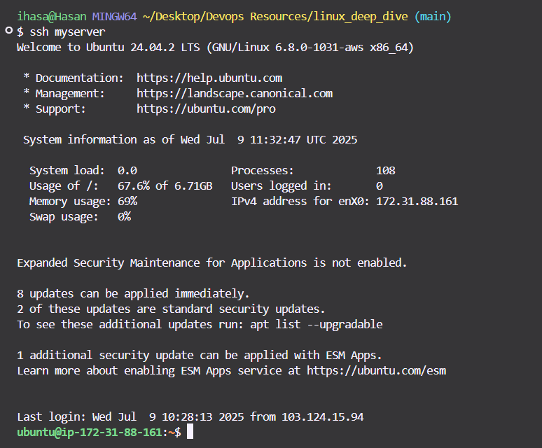

# Setting up Linux on AWS (EC2)
---
## Why Set Up Linux on AWS?

Running Linux on AWS gives you:

- Cloud-based practice for Linux CLI
- A safe environment to break/fix things
- Real DevOps infra, similar to what's used in production  

---

## Prerequisites

- AWS Account — Sign up at [aws.amazon.com](https://aws.amazon.com/)
- Free Tier: 750 hrs/month of `t2.micro` (1 vCPU, 1 GB RAM)
- Basic Linux command-line knowledge

---

## Step 1: Log in to AWS Console

Go to [https://console.aws.amazon.com/](https://console.aws.amazon.com/) and sign in.

---

## Step 2: Launch EC2 Instance (Linux)

1. Search for **EC2** in the AWS console.
2. Click **"Launch Instance"**
3. Fill in instance details:
   - **Name**: `linux-devbox
   - **AMI** (OS): `Ubuntu`
   - **Instance Type**: `t2.micro` (Free tier eligible)
4. **Key Pair**:
   - Choose **"Create new key pair"**
   - Name it: `aws-ec2-key`
   - Format: `.pem`
   - Download and save it safely
5. **Networking**:
   - Use default VPC
   - In **Security Group**, allow SSH (port 22)
6. Click **"Launch Instance"**

---

## 🔐 Step 3: Connect via SSH

### On Windows:

Use **PowerShell**, **Git Bash**, or **WSL**:

```bash
cd path/to/downloaded/key
chmod 400 aws-ec2-key.pem   # For Git Bash or Linux
ssh -i aws-ec2-key.pem ec2-user@<Public-IP>
```
---

Replace <Public-IP> with the EC2 instance’s public IP address. Use the correct user based on the OS:

ec2-user → Amazon Linux

ubuntu → Ubuntu

centos / rocky → CentOS or RHEL

---

We can save the identity file pem file location and username in the ssh config file : More at here:  https://chatgpt.com/share/686e5429-651c-8013-88ad-497d66073cfe

---

#### After then we can see the screen as below, we would be logged in




