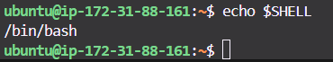

# Understand and use essential tools

## 01 Access a shell prompt and issue commands with correct syntax

TThe **shell** is a program that interprets your commands and sends them to the Linux kernel.

Think of it as your **personal translator** between you (human) and Linux (machine).

- Default shell in RHEL = **`bash`** (Bourne Again Shell)
- Other shells: `sh`, `zsh`, `dash`, `fish`, etc.

🧪 Check which shell you're using:
```bash
echo $SHELL



🧠 Understanding Command Syntax

#### 02 Use input-output redirection (>, >>, |, 2>, etc.)

#### 03 Use grep and regular expressions to analyze text
#### 04 Access remote systems using SSH
#### 05 Log in and switch users in multiuser targets
#### 06 Archive, compress, unpack, and uncompress files using tar, gzip, and bzip2
#### 07 Create and edit text files
#### 08 Create, delete, copy, and move files and directories
#### 09 Create hard and soft links
#### 10 List, set, and change standard ugo/rwx permissions
#### 11 Locate, read, and use system documentation including man, info, and files in /usr/share/doc