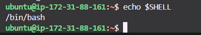

# Understand and use essential tools

### 01 Access a shell prompt and issue commands with correct syntax

The **shell** is your interface to the Linux system. It allows users to type commands which the operating system will then execute.

- Default shell in RHEL: **bash**
- You interact with the **shell prompt** which looks like:

💻 Accessing the Shell

### On Local Machine:
```bash
echo $SHELL



#### 02 Use input-output redirection (>, >>, |, 2>, etc.)

#### 03 Use grep and regular expressions to analyze text
#### 04 Access remote systems using SSH
#### 05 Log in and switch users in multiuser targets
#### 06 Archive, compress, unpack, and uncompress files using tar, gzip, and bzip2
#### 07 Create and edit text files
#### 08 Create, delete, copy, and move files and directories
#### 09 Create hard and soft links
#### 10 List, set, and change standard ugo/rwx permissions
#### 11 Locate, read, and use system documentation including man, info, and files in /usr/share/doc